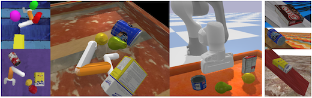
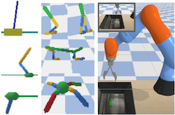
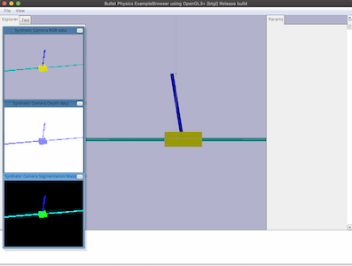
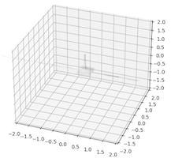
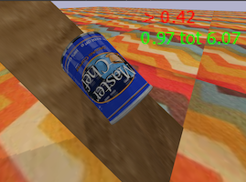
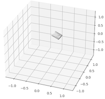
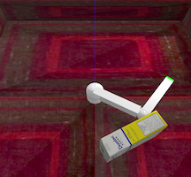
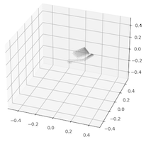
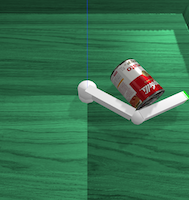
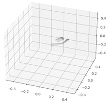

## Benchmarks for Unified Learning with pyBullet

This repository contains code for the environments presented in:
[*Analytic Manifold Learning: Unifying and Evaluating Representations for Continuous Control*](https://arxiv.org/abs/2006.08718)
```
@article{antonova2020analytic,
  title={Analytic Manifold Learning: Unifying and Evaluating Representations for Continuous Control},
  author={Rika Antonova and Maksim Maydanskiy and Danica Kragic and Sam Devlin and Katja Hofmann},
  journal={arXiv preprint arXiv:2006.08718},
  year={2020}
}
```

*RearrangeGeom*, *RearrangeYcb*, *YcbOnIncline* 
environments proposed by the arXiv paper are visualized below:



The package also contains wrappers for existing pyBullet benchmark 
environments to enable reporting both high-dimensional state 
(RGB images or point clouds) and low-dimensional state 
(e.g. robot joint angles, velocities, contacts):




### Installation

```
virtualenv -p `which python3` BULB_ENV
source BULB_ENV/bin/activate
pip install numpy
pip install -e "git+https://github.com/contactrika/bo-svae-dc.git#egg=gym_bullet_extensions-0.1&subdirectory=gym-bullet-extensions"
pip install -e .
```
Note: the above instructions install numpy before other packages that
depend on PyBullet to ensure numpy-based parsing of point clouds.

To use envs in your python code do: ```import bulb``` (this would
do gym registration).


### Example Visualization Demos
```
python -m bulb.env_demo \
  --env_name=ReacherRearrangeGeomIM64-v0 \
  --num_episodes=10 --debug --viz

python -m bulb.env_demo \
  --env_name=YcbOnInclinePT1024-v0 --debug --viz

python -m bulb.env_demo \
  --env_name=YcbOnInclineLD-v3 --debug --viz
```

The pattern for env names is:
```[BaseEnvName][LD/IM/PT][resolution]-v[version]```

* LD: low-dimensional simulation state is reported as obs.
* IM: camera image is reported as obs (3 x H x W numpy array 
with pixel values in [0,1] and H=W=resolution).
* PT: point cloud of the scene is reported as obs 
(num. pts = resolution).

*RearrangeYcb* and *YcbOnIncline* envs have 6 versions with various
backgrouns and objects.

Rearrange envs have two choices for the robot: *Reacher* and *Franka*.
The robot names are used as a prefix to BaseEnvName.

Replace *Ycb* with *Geom* to get envs with simple geometric shapes
instead of objects from YCB meshes.


### Benchmark Envs

The pattern for PyBullet benchmark env names is:
```[BaseEnvName]BulletEnv[LD/IM/PT][resolution]-v[version]```

Environments with the following BaseEnvNames are available:

```InvertedPendulum, InvertedDoublePendulum, InvertedPendulumSwingup, Hopper, Walker2D, HalfCheetah, AntBullet, Kuka```

The above have continuous action space and version v=0

```CartPole``` is available with discrete action space and version v=1

Examples:

```
python -m bulb.env_demo --env_name=AntBulletEnvLD-v0 --debug --viz

python -m bulb.env_demo --env_name=HalfCheetahBulletEnvIM64-v0 --debug --viz

python -m bulb.env_demo --env_name=CartPoleBulletEnvPT1024-v1 --debug --viz
```

### Envs with Point Clouds

Note that pyBullet has problems with reporting point cloud data
for XML-based robots (from MJCF formats), so benchmarks like 
pendulum envs and locomotion envs with XML-based robots are affected 
by this issue. Robots in the URDF format seem to be unaffected
by this problem.

This package provides several envs for which point cloud output
works fine: ```CartPoleBulletEnvPT1024-v1```, 
*YcbOnIncline*, *ReacherRearrange*, *FrankaRearrange*.

Example of CartPole with 1024 points in a point cloud:

```
python -m bulb.env_demo --env_name=CartPoleBulletEnvPT1024-v1 --viz --debug
```




Below is a visualization of *YcbOnIncline* with one of 6 YCB objects 
with an observation as a point cloud with 1024 points.
The goal is to keep the object in the center of the incline.
RL has 1D action that just pushes the object up/down along
the incline with the given force. The force and direction
are visualized with a text annotation on the (debug) image.

```
python -m bulb.env_demo --env_name=YcbOnInclinePT1024-v5 --viz --debug
```




Note: incline plane is not included in the point cloud for 
faster processing.

Replace 1024 with any of 64,128,256,512,2048 to get a smaller/larger
number of points in the point clouds,
e.g. ```YcbOnInclinePT256-v5```

Replace ```-v5``` with any version from 0 to 5 to get a different object,
e.g. ```YcbOnInclinePT1024-v2```

Replace Ycb with Geom to use simple shapes:
e.g. ```GeomOnInclinePT1024-v5```.

Use suffix ```Sm``` for small and ```Md``` for medium sized object,
e.g. ```GeomOnInclineMdPT1024-v5```


For envs with a simple reacher robot use:

```
python -m bulb.env_demo --env_name=ReacherRearrangeOneYcbPT2048-v1 --viz --debug
```







Note: point clouds visualizations on the right are given from a 
different step, just to give a general idea; 
they are not supposed to correspond to the env visualization on the
left (that is recorded at the start of the episode).

```ReacherRearrangeOneYcbPT2048``` name can be altered as follows:

* Remove ```One``` to load 4 objects
* Replace ```Ycb``` with ```Geom``` to load simple shapes
* Can choose from versions 0-5 to get different objects and color textures

```
python -m bulb.env_demo --env_name=ReacherRearrangeGeomPT1024-v0 --viz --debug
```

Using ```--debug``` flag will cause the demo to output png
files with visualized point clouds to ```/tmp/```.

See example output images and point cloud visualizations in
[misc/img](misc/img) folder.

<br />
<hr />

<sub>**A note about this implementation:** The code in this package is for basic academic experiments.
It favors simplicity over performance and does not try to follow any particular style guidelines. It would be organized differently if we aimed for
reliability/deployment in an industrial setting.</sub>
