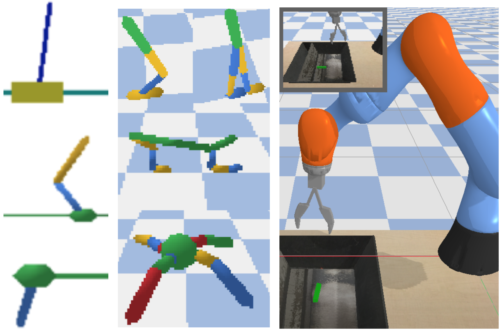
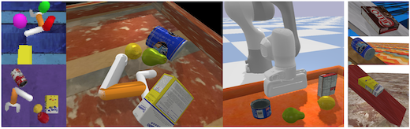

## gym-bullet-aux

This package contains pyBullet benchmark environments that are extended to report both high- and low-dimensional state and the new *RearrangeGeom* and *RearrangeYCB* environments.




### Installation

```
virtualenv --no-site-packages -p /usr/bin/python3.6 AUX_ENV
source AUX_ENV/bin/activate
pip install numpy
pip install -e "git+https://github.com/contactrika/bo-svae-dc.git#egg=gym_bullet_extensions-0.1&subdirectory=gym-bullet-extensions"
cd gym-bullet-aux
pip install -e .
```

### Usage Examples
```
python -m gym_bullet_aux.aux_env_demo --env_name=ReacherRearrangeGeom64-v0 --num_episodes=10 --debug --viz
python -m gym_bullet_aux.aux_env_demo --env_name=BlockOnInclineYcb-v0 --debug --viz
python -m gym_bullet_aux.aux_env_demo --env_name=BlockOnInclineYcb-v3 --debug --viz
```

### Running  Benchmarks

The following behcmark environments are available:
```AuxInvertedPendulumBulletEnv-v0, AuxInvertedDoublePendulumBulletEnv-v0, AuxInvertedPendulumSwingupBulletEnv-v0, AuxHopperBulletEnv-v0, AuxWalker2DBulletEnv-v0, AuxHalfCheetahBulletEnv-v0, AuxAntBulletEnv-v0, AuxKukaBulletEnv-v0```

The above have continuous action space, ```AuxCartPoleBulletEnv-v1``` is available with discrete action space.

```
python -m gym_bullet_aux.aux_env_demo --env_name=AuxAntBulletEnv-v0 --debug --viz
```

To get low-dimensional simulator state in observations (instead of RGB observations) add ```LD``` suffix, e.g. ```AuxInvertedPendulumLDBulletEnv-v0```.

To get a version of domain that would be visualized add ```Viz``` suffix: ```AuxInvertedPendulumBulletEnvViz-v0```

### Using Envs with Point Clouds

A few of the envs can output point clouds.
For example: CartPole with 1024 points in a point cloud:

```
python -m gym_bullet_aux.aux_env_demo \
  --env_name=AuxCartPolePT1024BulletEnv-v1 --viz --debug
```

BlockOnIncline with one of 6 Ycb objects and 1024 points:

```
python -m gym_bullet_aux.aux_env_demo \
  --env_name=BlockOnInclineYcbPT1024-v5 --viz --debug
```

Note: incline plane is not included in the point cloud for 
faster processing.

Replace 1024 with any of 64,128,512,2048 to get a smaller/larger
number of points in the point clouds,
e.g. ```BlockOnInclineGeomMdPT128-v5```

Replace ```-v5``` with any verion from 0 to 5 to get a different object,
e.g. ```BlockOnInclineYcbPT1024-v0```

Replace Ycb with Geom to use simple shapes:
e.g. ```BlockOnInclineGeomPT1024-v5```.

Use suffix ```Sm``` for small and ```Md``` for medium sized object,
e.g. ```BlockOnInclineGeomMdPT1024-v5```


For envs with a very simple reacher robot use:

```
python -m gym_bullet_aux.aux_env_demo \
--env_name=UreacherRearrangeOneYcbPT2048-v1 --viz --debug
```

Remove ```One``` to load 4 objects; replace ```Ycb``` with ```Geom```
to load simple shapes. Can choose from versions 0-5 to get different
objects and color textures.

```
python -m gym_bullet_aux.aux_env_demo \
--env_name=UreacherRearrangeGeomPT1024-v0 --viz --debug
```

Using ```--debug``` flag will cause the demo to output png
files with visualized point clouds to ```/tmp/```.

See example output images and point cloud visualizations in
[img](img) folder.

<br />
<hr />

<sub>**A note about this implementation:** The code in this package is for basic academic experiments.
It favors simplicity over performance and does not try to follow any particular style guidelines. It would be organized differently if we aimed for
reliability/deployment in an industrial setting.</sub>
