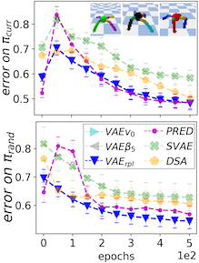
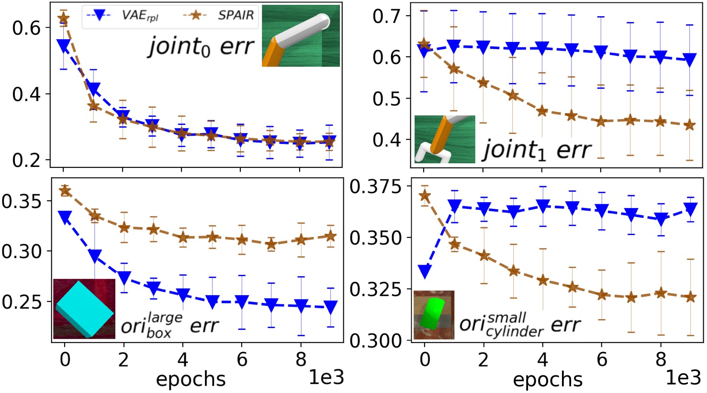

## unsup-eval-suite

This package contains unsupervised learners (VAE, SVAE, PRED, DSA) and functionality for measuring alignment between the learned latent state and the true low-dimensional (simulator) state; also contains an interface with a PPO RL learner.




### Install

```
virtualenv --no-site-packages -p /usr/bin/python3.6 AUX_ENV
source AUX_ENV/bin/activate
cd unsup-eval-suite
pip install -e .
```

### Usage Examples

Quick check with a small minibatch and small replay buffer:

```
python -m unsup_eval_suite.main_learn --gpu=0 --save_path_prefix=~/Desktop/tmp/ \
--num_envs_per_worker=4 --agent_max_replay_rollouts=128 --agent_rollout_len=8 \
--unsup_batch_size=8 --unsup_num_sub_epochs=1 --unsup_lr=1e-3 \
--unsup_class=SVAE --unsup_params_class=PARAMS_VAE_REARR \
--env_name=ReacherRearrangeYcb64 --agent_algo=Random  \
--max_epochs=500 --log_interval=1 --viz_interval=10 \
--analyze_dataset_size=100 --analyze_max_iter=100 --analyze_interval=10
```

Launch train+analyze run for *CartPole*:

```
python -m unsup_eval_suite.main_learn --gpu=0 --save_path_prefix=~/Desktop/tmp/ \
--num_envs_per_worker=16 --agent_max_replay_rollouts=5000 --agent_rollout_len=10 \
--unsup_batch_size=1024 --unsup_num_sub_epochs=10 --unsup_lr=1e-3 \
--unsup_class=SVAE --unsup_params_class=PARAMS_VAE \
--env_name=AuxCartPoleBulletEnv-v1 --agent_algo=PPO \
--max_epochs=500 --log_interval=10 --viz_interval=100 \
--analyze_dataset_size=10000 --analyze_max_iter=10000 --analyze_interval=100
```

See results in Tensorboard:

```
tensorboard --logdir_spec=a:~/Desktop/tmp --port=6008 --bind_all  --samples_per_plugin images=100
```

<br />
<hr />

<sub>**A note about this implementation:** The code in this package is for basic academic experiments.
It favors simplicity over performance and does not try to follow any particular style guidelines. It would be organized differently if we aimed for
reliability/deployment in an industrial setting.</sub>
